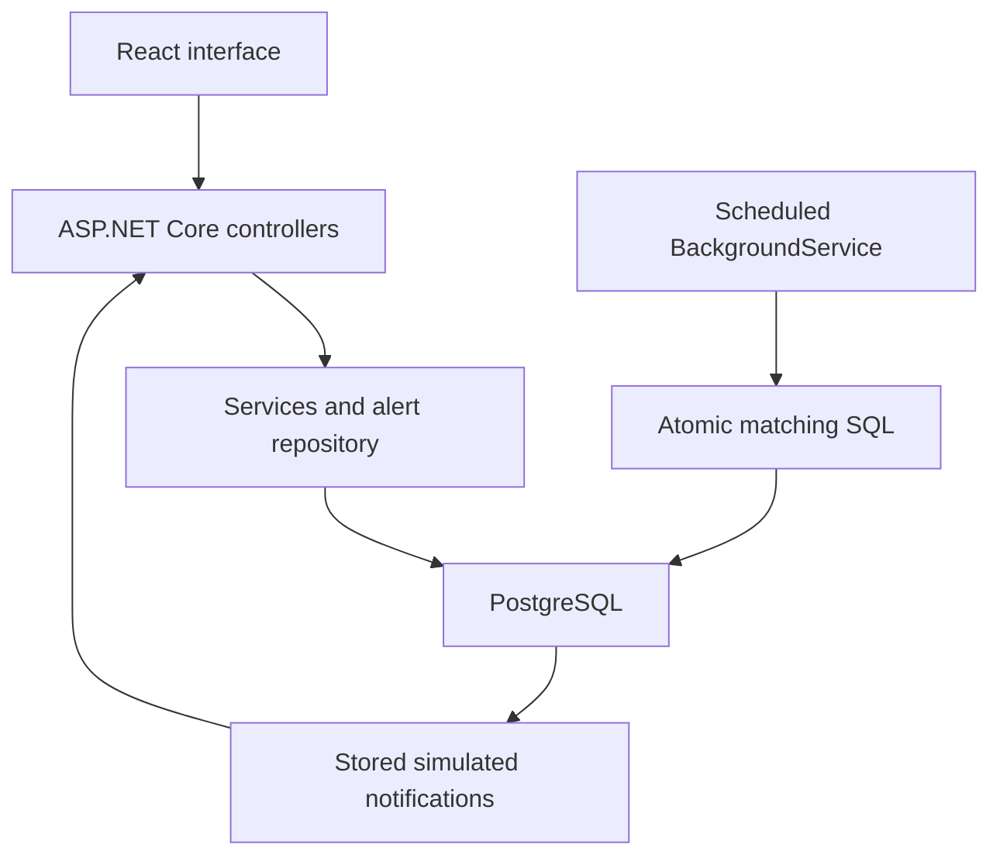

# Build an Australian Real Estate Alert App

## What you will build

A complete learning app with a C# / ASP.NET Core API, a React + TypeScript interface, and PostgreSQL. All property listings are fictional. The app neither scrapes property websites nor sends real email. Notifications are database rows displayed in an inbox.

This guide replaces the architecture in the supplied Azure roadmap. There is no Express backend, Cosmos DB, Service Bus, Azure Function, Redis or separate email provider. Node.js is used only for React tooling and development scripts. The optional production container serves the React build through ASP.NET Core.

**How to use this package:** first run the quick start. Then study the phases in order. `FINAL_SOURCE.md` contains the complete authored source files in reading order; the source folders contain runnable files. There are no TODO methods or missing implementation placeholders. Short code extracts in this guide explain the important lines; use the complete files when building.

**Scope:** a working educational application, not a public property marketplace. Authentication is intentionally small: an Identity password hasher plus custom JWT issuance, without the full ASP.NET Identity database model. There is no email verification, password reset, refresh-token rotation, account deletion or real email delivery. Those are future product features, not secretly required services.

## Suggested weekly timeline

Allow **8 weeks at roughly 8–10 hours per week** if C# is new to you. This is a suggested learning estimate, not a promise. At 3 hours per week, spread the same work across about 22–27 weeks. Do not try to understand every framework in one weekend.

| Week | Phases | Main result | Suggested effort |
|---|---|---|---|
| 1 | 1–2 | Run the app; learn C# syntax and request flow | 8–10 hours |
| 2 | 3 | Model data, migrate PostgreSQL, inspect indexes | 8 hours |
| 3 | 4–5 | Register/login, validation and protected endpoints | 10 hours |
| 4 | 6 | Scheduled matching and duplicate protection | 8–10 hours |
| 5 | 7–8 | Generated client, login and alert forms | 10 hours |
| 6 | 9 | Listings, admin input and notification inbox | 8 hours |
| 7 | 10–11 | Unit/integration/UI tests, Docker and CI | 10 hours |
| 8 | 12 | Final demo and optional Azure deployment | 6–10 hours |

For each study session: read one file, predict what it does, run it, change one small rule, and verify the result. Keep a short note of what you learned.

## Architecture and exact matching rules



The API and worker run in the **same ASP.NET Core process**. The frontend reads the inbox every five seconds. The worker checks every fifteen seconds by default. Under light load, allow approximately twenty seconds for a listing to appear in the inbox; this is a polling interval expectation, not a latency guarantee.

| Field or situation | Rule in this solution |
|---|---|
| Location | Supply suburb, postcode, or both. If both are supplied, both must match. |
| Suburb | Trim whitespace and convert to lowercase on write; exact matching after normalization. |
| Postcode | Four-character string. `0800` keeps its leading zero. No geographic lookup is performed. |
| Suburb ambiguity | Suburb-only alerts can span different states with the same suburb name; add postcode for precision. |
| Price | Australian dollars; inclusive minimum and maximum; backend stores `decimal` / PostgreSQL `numeric(14,2)`. |
| Bedrooms | Listing bedrooms must be at least the requested number. Zero permits studios or land. |
| Type | `house`, `unit`, `townhouse`, `land`; blank alert type means any type. |
| New alert | Only listings with `CreatedAt >= ActiveSince` are eligible. Existing listings are not backfilled. |
| Edited/re-enabled alert | Resets `ActiveSince`; matching starts again for future listings. |
| Paused alert | Does not create new notifications. |
| Old notifications | Remain visible after edits or pauses. A pause cannot retract a notification already inserted by a concurrent poll. |
| Duplicate processing | Unique `(AlertId, ListingId)` plus `ON CONFLICT DO NOTHING`. |
| Overlapping alerts | A listing can produce one notification per matching alert. This is intentional. |
| Time | Database-generated UTC timestamps; browser displays the user's local time. |
| Listing replay | Submitting an admin POST twice creates two separate fake listings. Notification idempotency is per stored listing ID, not per identical JSON body. |

## Phase 1 — Install tools and run the finished app

### Step 1.1 — Prepare your computer

**Goal:** have the tools needed to build C#, React and containers.

Install the .NET **10 SDK** (not only the runtime), Node.js **24 LTS**, Git, and Docker Desktop with Linux containers. VS Code plus C# Dev Kit is a convenient editor. Use the platform-specific installers from official sites. Package versions are pinned in the project; use the included lockfile instead of recreating it from memory.

**Commands** — run in PowerShell, macOS Terminal or Bash:

```sh
dotnet --info
node --version
npm --version
docker version
docker compose version
git --version
```

**Files:** the extracted project root contains `AussieAlerts.slnx`, `Directory.Build.props`, `src/Api`, `tests/Api.Tests`, `web`, `scripts`, `compose.yaml` and `Dockerfile`.

**Key code:** `Directory.Build.props` gives both C# projects the same target and enables nullable checking:

```xml
<TargetFramework>net10.0</TargetFramework>
<Nullable>enable</Nullable>
<ImplicitUsings>enable</ImplicitUsings>
<TreatWarningsAsErrors>true</TreatWarningsAsErrors>
```

**Verify:** .NET reports a 10.x SDK, Node reports 24.x, and `docker version` shows both client and server. If Docker only shows the client, start Docker Desktop.

### Step 1.2 — Start everything with Docker Compose

**Goal:** see the finished behavior before studying its internals.

Extract the ZIP, open a terminal **inside `aussie-alerts`**, then run:

```sh
node scripts/setup.mjs
docker compose up --build
```

Leave that terminal open. First startup can take several minutes because Docker downloads images and package dependencies. Open:

- App: <http://localhost:5173>
- OpenAPI JSON: <http://localhost:8080/openapi/v1.json>
- Swagger UI: <http://localhost:8080/swagger>
- API liveness: <http://localhost:8080/health/live>
- Database readiness: <http://localhost:8080/health/ready>

**Files/key code:** `scripts/setup.mjs` uses Node's `crypto.randomBytes` to create a local `.env` file. `compose.yaml` passes `Jwt__Key`, `ConnectionStrings__Database` and seed credentials into ASP.NET. Double underscores map to nested .NET configuration keys such as `Jwt:Key`.

```yaml
ConnectionStrings__Database: Host=postgres;Database=${POSTGRES_DB};Username=${POSTGRES_USER};Password=${POSTGRES_PASSWORD}
Database__AutoMigrate: "true"
```

The API runs the included migration and creates the demo admin on first start. Open `.env` locally to see `ADMIN_EMAIL` and `ADMIN_PASSWORD`. The setup script does not print passwords and does not overwrite an existing file.

**Verify with this exact example:**

1. Register `learner@example.test` with a password such as `LearningCSharp123!` (fictional demo account only).
2. Create an alert: postcode `0800`, minimum `400000`, maximum `600000`, minimum bedrooms `2`, type `unit`, active checked. Leave suburb blank.
3. Open a separate browser/private window. Log in with the generated admin credentials.
4. Open **Listings → Admin: add a fake listing**. Submit the prefilled Darwin example: `500000`, `2` bedrooms, `unit`, `0800`.
5. Return to the learner's **Inbox**. Allow about twenty seconds. One simulated notification should appear.
6. Wait another thirty seconds. The same listing must not create another notification.
7. Mark it read. Reloading the page requires login again, but the read status stays in PostgreSQL.

### Phase 1 checklist

- [ ] App, Swagger and health URLs open.
- [ ] A new user can register and log in.
- [ ] One matching fake listing produces one stored notification.
- [ ] Repeated scheduled checks do not duplicate it.

**Common pitfalls:** ports 5432, 8080 or 5173 already occupied; Docker Desktop stopped; running commands outside the project root; using real personal/property data; losing the leading zero in `0800`. `localhost` inside the API container points to that container, so its database host must be `postgres`.

## Phase 2 — Learn the C# you need and understand the project

### Step 2.0 — Optional build from an empty folder

**Goal:** reproduce the project yourself instead of only reading the finished version. Do this in a **separate folder** so you keep the working reference copy.

**Commands** (from the folder where you want your new project):

```sh
mkdir aussie-alerts-practice
cd aussie-alerts-practice
dotnet new sln --name AussieAlerts --format slnx
dotnet new webapi -n Api -o src/Api --use-controllers -f net10.0
dotnet new xunit -n Api.Tests -o tests/Api.Tests -f net10.0
dotnet sln AussieAlerts.slnx add src/Api/Api.csproj tests/Api.Tests/Api.Tests.csproj
dotnet add tests/Api.Tests reference src/Api
dotnet new tool-manifest
dotnet tool install dotnet-ef --version 10.0.12
npm create vite@6.4.1 web -- --template react-ts
```

**Files and implementation order:** remove the template WeatherForecast files and sample `UnitTest1.cs`. Remove the template `Properties/launchSettings.json` or continue to use the provided `--no-launch-profile` launcher. In your editor, create the folders/files listed in each phase and copy their **complete contents** from `FINAL_SOURCE.md` or the reference project, in this order:

1. Root configuration, `src/Api/Api.csproj`, and `web/package.json` / TypeScript/Vite configuration.
2. `Domain`, `DTOs`, `Data/AppDb.cs` and `Data/AppDbFactory.cs`.
3. `Repositories`, `Services`, `Infrastructure`, `Controllers`, `Program.cs`, `appsettings.json`.
4. `scripts`, `.env.example`, `compose.yaml` and Docker files.
5. The included migration files **or** generate your own initial migration (see below).
6. React `src` files, then export OpenAPI and generate `schema.d.ts`.
7. All test files and the CI workflow.

Use the reference `.csproj` and `package.json` versions, not whatever a future template chooses. Copy the supplied `web/package-lock.json` with its matching package file, then use `npm ci --prefix web`. All authored implementation files are complete in the package. No code from the earlier TypeScript/Cosmos roadmap is needed.

**Key commands after the backend source is in place:**

```sh
dotnet restore AussieAlerts.slnx -m:1
dotnet build AussieAlerts.slnx -m:1
```

If you **did not copy** the supplied `Data/Migrations` folder, generate your initial migration now:

```sh
dotnet ef migrations add InitialCreate --project src/Api --output-dir Data/Migrations
```

Do not both copy the existing initial migration and generate a second initial migration. Continue with Phase 3 to apply it.

**Verify:** the scaffolded project has the same file structure as the reference, builds, and eventually passes the same tests. It is normal for incomplete intermediate stages to fail to compile until their referenced types/files are added. Use the finished project as your running reference while you implement a phase in the practice copy.

### Step 2.1 — Translate familiar JavaScript ideas into C#

**Goal:** read the backend without learning the entire language first.

| JavaScript/TypeScript idea | C# equivalent in this project |
|---|---|
| `package.json` | `.csproj`: project settings and NuGet package references |
| `npm install` | `dotnet restore` |
| `npm run build` | `dotnet build` |
| Object shape/type | Class for tracked database objects; record for request/response data |
| `Promise<T>` | `Task<T>` |
| `async` / `await` | Same basic asynchronous waiting pattern |
| `string \| null` | `string?` |
| `number` for money | `decimal` (`500000m` literal), not binary floating-point |
| `array.filter(...)` | LINQ `.Where(...)` |
| `array.map(...)` | LINQ `.Select(...)` |
| Express route | Controller action with `[HttpGet]` or `[HttpPost]` |
| Middleware | `app.UseAuthentication()`, error middleware, etc. |
| Module dependency passed to function | Constructor dependency injection |

**Commands:**

```sh
dotnet restore AussieAlerts.slnx -m:1
dotnet build AussieAlerts.slnx -m:1
```

**Files/key code:** start with `Domain/Entities.cs`, `DTOs/Contracts.cs`, `Repositories/AlertRepository.cs`, then `Controllers/AlertsController.cs`.

```csharp
public sealed record AlertRequest(string? Suburb, string? Postcode,
    decimal MinPrice, decimal MaxPrice, int MinBedrooms,
    string? PropertyType, bool Active);
```

`public` means accessible from other code; `sealed` stops inheritance; `record` creates a compact data type with generated equality and properties. `Guid` is a UUID. `CancellationToken` allows a disconnected request or stopping worker to cancel database work. `using` imports a namespace; `await using` also disposes a resource asynchronously.

**Verify:** explain why `Postcode` is a string and `Price` is a decimal. Find the `await` that saves an alert. Temporarily misspell a property in an uncommitted copy and observe the compiler error; undo the change.

### Step 2.2 — Trace a request through the folders

**Goal:** know where each change belongs.

| File/folder | Responsibility |
|---|---|
| `src/Api/Program.cs` | Configure dependency injection, middleware, JWT, routes and worker |
| `Domain/Entities.cs` | Four stored entity types |
| `DTOs/Contracts.cs` | Public request and response shapes |
| `DTOs/Validators.cs` | Input rules |
| `Data/AppDb.cs` | EF mappings, relationships, indexes, constraints |
| `Data/Migrations/` | Generated initial migration, designer and snapshot |
| `Repositories/AlertRepository.cs` | Reusable owner-scoped alert queries |
| `Services/AlertService.cs` | Create/edit alert behavior and normalization |
| `Services/AuthService.cs` | Password verification and JWT generation |
| `Services/MatchService.cs` | Matching SQL and scheduled worker |
| `Infrastructure/Errors.cs` | Safe global error responses |
| `Controllers/` | HTTP routing, validation and authorization boundaries |

**Commands:**

```sh
dotnet build src/Api
```

**Key code:**

```csharp
builder.Services.AddScoped<AlertRepository>();
builder.Services.AddScoped<AlertService>();
```

ASP.NET creates these objects for a request. `Scoped` normally means one instance per request scope. A hosted service lives longer, so it creates a new scope per poll instead of holding one `DbContext` forever. A `DbContext` is not thread-safe.

The focused alert repository is deliberate. EF Core already provides a unit of work, so simple listing/inbox reads use `AppDb` directly instead of adding a generic repository around every method.

**Verify:** follow `POST /api/alerts`: controller → validator → service → repository → `SaveChangesAsync` → PostgreSQL → response DTO. Notice the client never supplies `UserId`.

### Phase 2 checklist

- [ ] You can explain class, record, nullable type, Task and dependency injection.
- [ ] You can locate the validation, business rule and SQL layers.
- [ ] The C# solution builds.

**Common pitfalls:** treating `var` as a dynamic type (it is inferred but still statically typed); forgetting `await`; sharing a `DbContext` across tasks; returning the user entity and accidentally exposing `PasswordHash`.

## Phase 3 — PostgreSQL, EF Core and migrations

### Step 3.1 — Understand the schema and query indexes

**Goal:** store users, alerts, listings and notifications with database-level guarantees.

**Commands:**

```sh
docker compose up -d postgres
dotnet tool restore
dotnet ef migrations list --project src/Api
dotnet ef migrations has-pending-model-changes --project src/Api
```

Listing migrations may attempt a database connection using design-time defaults. For applying migrations locally use `node scripts/run-api.mjs --migrate-only`, which reads the actual `.env` credentials, or explicitly configure `ConnectionStrings__Database`.

**Files:** `Data/AppDb.cs`, `Data/AppDbFactory.cs`, `Data/Migrations/*`.

| Table | Key data | Important relationships/indexes |
|---|---|---|
| Users | UUID, normalized email, password hash, role | Unique email |
| Alerts | Owner, location, budget, bedrooms, type, active flag, cutoff | FK to Users; active/postcode index |
| Listings | Fake title, location, price, bedrooms, type, timestamp | `(Postcode, Price)`, `Price`, `CreatedAt` indexes |
| Notifications | Owner, alert/listing pair, subject/body, read time | Unique `(AlertId, ListingId)`; owner/time index; FKs |

**Key code:**

```csharp
e.Property(x => x.Price).HasPrecision(14, 2);
e.HasIndex(x => new { x.Postcode, x.Price });
e.HasIndex(x => x.Price);
```

The composite index supports postcode equality plus a price range. A separate price index helps searches without postcode. A tiny dataset may still use a sequential scan; that is not proof the index is broken.

**Verify:** open a PostgreSQL shell:

```sh
docker compose exec postgres psql -U alerts -d alerts
```

Inside `psql`:

```sql
\dt
\d "Listings"
\d "Notifications"
SELECT indexname, indexdef FROM pg_indexes WHERE tablename = 'Listings';
SELECT "Email", "Role" FROM "Users";
\q
```

Do not print password hashes in logs or screenshots. The generated migration uses PostgreSQL UUID, timestamp with time zone, numeric and foreign-key constraints.

### Step 3.2 — Apply and evolve the model safely

**Goal:** learn the difference between changing C# code and changing an existing database.

**Commands:**

```sh
node scripts/run-api.mjs --migrate-only
```

For a future model change, after editing the entity and mapping:

```sh
dotnet ef migrations add DescribeYourChange --project src/Api --output-dir Data/Migrations
dotnet ef migrations script --idempotent --project src/Api --output migration.sql
node scripts/run-api.mjs --migrate-only
```

**Files/key code:** the included generated migration's `Up` creates tables/indexes; `Down` reverses it. The snapshot lets EF compare the previous schema with the current model. `Program.cs` invokes `Database.MigrateAsync()` for local development or the explicit one-shot mode.

```csharp
await scope.ServiceProvider.GetRequiredService<AppDb>().Database.MigrateAsync();
```

**Verify:** run the one-shot command twice. The second run should not recreate tables or lose data. `has-pending-model-changes` should report no changes for the unmodified project. Review generated migration SQL before applying it to a shared environment.

### Phase 3 checklist

- [ ] Four application tables and EF migration history exist.
- [ ] Postcode/price indexes exist.
- [ ] Money is numeric and timestamps are UTC-capable.
- [ ] Reapplying migrations preserves data.

**Common pitfalls:** using `EnsureCreated` with migrations; deleting applied migration files; editing the snapshot manually; inserting local-time `DateTime` values into `timestamptz`; changing `.env` database credentials after the volume was initialized. Existing PostgreSQL volumes retain their original credentials. `docker compose down` preserves data; `docker compose down -v` **deletes the local database**.

## Phase 4 — Authentication and access control

### Step 4.1 — Register, hash passwords and issue JWTs

**Goal:** let users authenticate without storing plain passwords.

**Commands for development outside Docker:** stop the Compose API/web to avoid port conflicts, keep PostgreSQL running, then:

```sh
docker compose stop api web
node scripts/run-api.mjs
```

In a second terminal:

```sh
npm ci --prefix web
npm --prefix web run dev
```

**Files:** `AuthController.cs`, `AuthService.cs`, `AdminBootstrap.cs`, `session.ts`, `Program.cs`.

**Key code:**

```csharp
user.PasswordHash = hasher.HashPassword(user, request.Password);
var result = hasher.VerifyHashedPassword(user, user.PasswordHash, request.Password);
```

The Microsoft Identity password hasher handles salts and its password-hash format. Login rehashes when the hasher reports the stored format should be upgraded. JWTs include `sub` (user UUID), `role`, issuer, audience and a thirty-minute expiry. The API validates signature, algorithm, issuer, audience and lifetime.

In the browser, the token is held **in memory**. Every API request adds `Authorization: Bearer ...`. Logout clears it and the TanStack Query cache. A page refresh requires login again. This is a deliberate beginner-friendly session design; it is not a refresh-token implementation. Browser logout does not revoke an already copied token; it remains usable until expiry.

**Verify:** registering returns an access token. Wrong password → 401. Registering the same normalized email twice → 409. Requesting `/api/alerts` without a token → 401. A modified/invalid token → 401.

### Step 4.2 — Enforce ownership and the admin boundary

**Goal:** stop one user reading or changing another user's records.

**Commands:**

```sh
dotnet test tests/Api.Tests --filter "Category=Integration"
```

Docker must be running for this command; Testcontainers starts a separate temporary PostgreSQL instance.

**Files/key code:** `AlertsController.cs` gets the owner from the verified JWT, never from the request body:

```csharp
private Guid Owner => Guid.Parse(User.FindFirstValue("sub")!);
```

`AlertRepository.FindAsync` requires both owner ID and alert ID. Inbox reads and mark-read updates also filter by owner. Admin listing creation has `[Authorize(Roles = "Admin")]`. Hiding the admin form in React is only a convenience; the server enforces the permission.

The bootstrap account only creates a new admin. It refuses to promote an existing normal account with the same email. Public registration always creates `User`, with no role field in its DTO. Bootstrap passwords are not automatically rotated by changing `.env` once the account exists.

**Verify:** register a second fictional user. Copy an alert UUID from the first user; editing it as the second user returns 404. Posting a listing as a regular user returns 403. Admin can add fictional listings.

### Phase 4 checklist

- [ ] Passwords are hashed and role assignment is server-controlled.
- [ ] Missing or invalid JWTs are rejected.
- [ ] Cross-user alert/inbox access is blocked.
- [ ] A normal user cannot create listings.

**Common pitfalls:** putting JWT secrets in `VITE_*` settings; using a short signing key; persisting tokens in example source files; assuming CORS is authorization; allowing the register body to choose `Admin`. The built-in per-IP login limit is process-local and not a complete production abuse-prevention system. Behind a proxy, configure trusted forwarding before relying on client-IP rate limits.

## Phase 5 — Validation, errors, health and logs

### Step 5.1 — Reject invalid input consistently

**Goal:** keep incorrect data out even when someone bypasses React.

**Commands:**

```sh
dotnet test tests/Api.Tests --filter "Category!=Integration"
```

**Files:** `Validators.cs`, every controller, `Infrastructure/Errors.cs`.

**Key code:**

```csharp
await validator.ValidateAndThrowAsync(request, ct);
```

Controllers call FluentValidation explicitly. Validation exceptions become HTTP 400 `ValidationProblemDetails`; expected API errors use their specific status; unexpected exceptions are logged and return a generic 500 with a trace ID. Malformed JSON and model binding errors may be handled earlier by `[ApiController]`.

**Verify:** send postcode `800`, maximum price less than minimum, an unknown type, or `Page=0`. Expect 400. No new database row should be created. React should display a useful validation message.

### Step 5.2 — Observe the app without leaking secrets

**Goal:** distinguish a running process from an app that can access its database.

**Commands:**

```sh
docker compose logs --tail 50 api
```

Open `/health/live` and `/health/ready`. Stop only PostgreSQL briefly during a local drill:

```sh
docker compose stop postgres
```

Then restart it:

```sh
docker compose start postgres
```

**Files/key code:** `Program.cs` registers Serilog request logging and `AddDbContextCheck<AppDb>`. Liveness uses no dependency checks. Readiness checks PostgreSQL. The worker logs a failure and retries at the next interval.

**Verify:** while PostgreSQL is unavailable, liveness can remain healthy while readiness returns 503. After the database returns, readiness and matching recover. Do not interpret readiness as a full data-consistency audit or a check of every table.

### Phase 5 checklist

- [ ] Validation rules run on the server.
- [ ] Unexpected errors do not return stack traces to clients.
- [ ] Logs include requests and worker outcomes without request bodies or credentials.
- [ ] Liveness and readiness have different purposes.

**Common pitfalls:** relying only on Zod; logging passwords/JWTs; exposing Swagger publicly with sensitive examples; making liveness depend on PostgreSQL and causing unnecessary restarts. Swagger/OpenAPI endpoints are enabled only in Development/Testing in this solution.

## Phase 6 — Scheduled matching with no duplicate notifications

### Step 6.1 — Understand the SQL and the schedule

**Goal:** turn a newly stored listing into persistent notification rows.

**Commands:**

```sh
dotnet test tests/Api.Tests --filter "Category!=Integration"
dotnet test tests/Api.Tests --filter "Category=Integration"
```

**Files:** `Services/MatchService.cs`, `Services/AlertService.cs`, `Data/AppDb.cs`.

**Key code:**

```sql
AND l."Price" BETWEEN a."MinPrice" AND a."MaxPrice"
AND l."Bedrooms" >= a."MinBedrooms"
ON CONFLICT ("AlertId", "ListingId") DO NOTHING;
```

Read the full `INSERT ... SELECT` in `MatchService`. It joins matching alerts/listings, builds a clearly labelled simulated-email subject/body, and inserts all missing notifications atomically. `NOT EXISTS` avoids unnecessary inserts; the unique index and `ON CONFLICT` provide the actual race protection.

`MatchingWorker` uses `PeriodicTimer`. A cycle creates a dependency-injection scope, resolves `MatchService`, awaits it, then waits for the next tick. Cycles do not overlap within one worker. The database handles races between multiple API instances. Cancellation stops the timer cleanly.

**Verify:** create an alert before adding the matching listing. Wait through several worker cycles. The count remains one for that pair. Insert listings just below/above the price boundaries and with too few bedrooms; they must not notify.

### Step 6.2 — Test failure, restart and edit semantics

**Goal:** understand what the reliability guarantee does and does not mean.

**Commands:**

```sh
docker compose restart api
```

**Files/key code:** `AppDb.cs` contains:

```csharp
e.HasIndex(x => new { x.AlertId, x.ListingId }).IsUnique();
```

There is no separate “listing processed” flag that can become inconsistent with notification insertion. A failed SQL statement rolls back as a whole. On restart the worker rechecks eligible pairs. If another transaction commits a listing after one scan started, the next scan can still see it because there is no advancing watermark.

A worker reads a database snapshot. If an alert is edited or paused during a scan, a notification based on the previous state may already be committed. This project does not promise immediate cancellation of work already in progress.

**Verify:** pause an alert, add a fake listing, and wait. No notification. Re-enable the alert; the listing added while paused is still not backfilled. Add another matching listing and confirm it notifies. Existing notifications remain.

### Phase 6 checklist

- [ ] Matching includes active state, time, location, price, bedrooms and type.
- [ ] Repeated and concurrent matching create no duplicate pairs.
- [ ] Restarting the API resumes matching.
- [ ] You can explain why the unique constraint is necessary.

**Common pitfalls:** checking for a row in C# and then inserting without a unique constraint; holding a single scoped database context in the singleton worker; using a watermark that skips late commits; expecting old listings to match new alerts. The full-history join is intentionally simple for small fake datasets; measure and redesign batching/retention before using millions of rows.

## Phase 7 — Generate the typed API client

### Step 7.1 — Export the live OpenAPI document

**Goal:** derive TypeScript request/response types from the API rather than writing duplicate interfaces.

Start the normal API first, or use a contract-only startup that needs no live database:

```sh
node scripts/run-api.mjs --contract
```

In another terminal at the project root:

```sh
node scripts/export-openapi.mjs
npm ci --prefix web
npm --prefix web run generate:api
```

**Files:** `openapi.json` → `web/src/api/schema.d.ts` → `web/src/api/client.ts`.

**Key code:**

```ts
const client = createClient<paths>({ baseUrl: import.meta.env.VITE_API_URL ?? '' });
```

`openapi-typescript` generates the `paths` and schema types. `openapi-fetch` consumes them to form a typed client. `client.ts` is a small handwritten convenience wrapper; the endpoint shapes and payload types come from the generated document. It adds the JWT and converts non-success responses into thrown errors so TanStack Query can show them.

**Verify:** regenerate, then run `npm --prefix web run build`. Intentionally misspell a path in a temporary edit to see TypeScript reject it; undo the change. Never repair contract errors by inserting `any` or editing generated types by hand.

### Phase 7 checklist

- [ ] The checked-in OpenAPI document comes from the API.
- [ ] The generated types compile with the frontend.
- [ ] CI detects contract drift after backend changes.

**Common pitfalls:** generating against a stopped API; exporting from Production where OpenAPI is disabled; accepting a stale hand-written schema; assuming generated types perform runtime input validation. Zod and server validation still matter.

## Phase 8 — React authentication and alert forms

### Step 8.1 — Connect routes, session state and server-state caching

**Goal:** separate page navigation, authentication state and database-backed state.

**Commands:**

```sh
npm --prefix web run dev
npm --prefix web run lint
```

**Files:** `main.tsx`, `App.tsx`, `session.ts`, `pages/AuthPage.tsx`.

**Key code:** `QueryClientProvider` shares the query cache, `BrowserRouter` handles routes, and the `Protected` route redirects unauthenticated sessions to `/login`. Authentication success clears old cache data before setting the new session. HTTP 401 and token expiry clear the session.

**Verify:** visiting `/alerts` without logging in goes to login. After login, navigation works. Log out as user A, then log in as user B: user A's cached inbox must not flash on screen. Refreshing a page intentionally returns to login.

### Step 8.2 — Build create/edit alert forms

**Goal:** use React Hook Form and Zod with numeric values and optional fields correctly.

**Commands:**

```sh
npm --prefix web test
```

**Files:** `forms.ts`, `pages/AlertsPage.tsx`, `test/AlertForm.test.tsx`.

**Key code:**

```tsx
<input type="number" {...form.register('minPrice', { valueAsNumber: true })}/>
```

Without `valueAsNumber`, HTML inputs supply strings. Blank optional fields become `null` before calling the API. The alert editor uses the alert ID as its React key so opening a different alert initializes the right values. Successful create/edit invalidates the `['alerts']` query.

**Verify:** saving without suburb/postcode shows an error and makes no API call. `0800` remains a string. Changing maximum below minimum fails. Editing an alert updates the list; remember that this resets its future matching window.

### Phase 8 checklist

- [ ] Register/login forms handle pending and error states.
- [ ] Protected routes work.
- [ ] Create/edit forms validate before sending.
- [ ] Successful writes invalidate the relevant query cache.

**Common pitfalls:** treating every input as a number; caching one user's data after logout; passing an API error response as successful query data; resetting form state on every render; assuming a client-side route guard protects the API.

## Phase 9 — Listings and the notification inbox

### Step 9.1 — Add browsing and admin fake-data input

**Goal:** browse paginated listings and let only admins create new fictional ones.

**Commands:**

```sh
npm --prefix web run build
```

**Files:** `Controllers/ListingsController.cs`; the frontend is `pages/ListingsPage.tsx`. The admin controller shares the backend file for a compact example.

**Key code:** the API orders by `CreatedAt` and then `Id`, validates page bounds, and uses `Skip`/`Take`. Its endpoint also accepts optional `MinPrice`/`MaxPrice` filters; the UI exposes a postcode filter and page controls. Prices render with `Intl.NumberFormat('en-AU', { currency: 'AUD', style: 'currency' })`.

**Verify:** add more than twelve fake listings and check the next page. Filtering to a nonexistent postcode shows an empty-state message. A regular user sees browsing but no admin form, and calling the admin API directly still returns 403.

### Step 9.2 — Read simulated emails

**Goal:** display server-owned notifications and store read status.

**Commands:**

```sh
npm --prefix web test
```

**Files:** `pages/InboxPage.tsx`, `NotificationsController.cs`.

**Key code:**

```ts
refetchInterval: 5000
```

The inbox polls with TanStack Query. It does not contain the matching engine. The mark-read endpoint updates only a notification belonging to the current user. Repeating mark-read preserves the original read timestamp.

**Verify:** one matching listing appears as unread; mark it read; log out and back in; it remains read. Another user cannot read or mark that notification.

### Phase 9 checklist

- [ ] Listings and inbox display loading, error and empty states.
- [ ] Pagination works with stable ordering.
- [ ] Admin input is clearly labelled fake.
- [ ] Read state persists in PostgreSQL.

**Common pitfalls:** expecting polling while a browser tab is suspended; sending real email unintentionally; exposing all inbox rows to every user; calculating matches in React instead of the server.

## Phase 10 — Tests that protect the important behavior

### Step 10.1 — Run unit, integration and UI tests

**Goal:** test business rules, actual PostgreSQL behavior and form interaction separately.

**Commands:**

```sh
dotnet test tests/Api.Tests --filter "Category!=Integration"
dotnet test tests/Api.Tests --filter "Category=Integration"
npm --prefix web test
```

**Files:** `MatchingTests.cs`, `ContractTests.cs`, `ApiFactory.cs`, `IntegrationTests.cs`, frontend `test` folder.

| Test type | What it verifies |
|---|---|
| xUnit unit tests | Inclusive prices, minimum bedrooms, location/type/time/active rules, postcode validation |
| API contract smoke test | In-process API startup, liveness, protected route, Swagger and OpenAPI without a database |
| Testcontainers integration tests | Real PostgreSQL migrations, normalization, JWT/auth boundaries, owner isolation, indexes, no pending model changes, read status |
| Concurrent integration check | Two independently scoped match services race, then retry; only one row per alert/listing pair |
| Edit/pause integration check | Inactive alerts do not notify; reactivation starts a future window |
| Vitest + React Testing Library | Missing location blocks submission; valid postcode sends the expected payload; schema keeps leading zero |

Testcontainers starts `postgres:17-alpine` with a random host port, applies real EF migrations, and removes the test database container afterward. It does not use your Compose database. The test factory disables the background timer so matching can be triggered deterministically; the manual demo tests the actual fifteen-second schedule.

**Key code:**

```csharp
await Task.WhenAll(MatchAsync(), MatchAsync());
Assert.Equal(0, await MatchAsync());
```

**Verify:** all applicable tests pass on a machine with Docker. Temporarily remove a rule and see the relevant test fail, then restore it. Unit tests alone do not prove that PostgreSQL SQL and indexes work.

### Phase 10 checklist

- [ ] Pure rule tests pass.
- [ ] Integration tests use real PostgreSQL, not EF InMemory.
- [ ] Concurrent retries are tested.
- [ ] Form tests exercise user actions rather than snapshots only.

**Common pitfalls:** running Docker-based tests while Docker is stopped; testing only the in-memory reference matcher while breaking SQL; leaving a timer active in integration tests and getting unpredictable counts; sharing a test database between parallel classes without isolation. This project keeps the integration scenarios in one xUnit class.

## Phase 11 — Docker and GitHub Actions

### Step 11.1 — Understand development versus production containers

**Goal:** run the complete stack locally and build a deployable container.

**Commands:**

```sh
docker compose up --build
docker compose ps
docker build --target production -t aussie-alerts:local .
```

**Files:** `Dockerfile`, `web/Dockerfile.dev`, `compose.yaml`, `.dockerignore`.

**Key code:** the production Dockerfile uses Node to compile React, .NET SDK to publish the API, then the ASP.NET runtime image to run the app as its non-root user. React assets are copied to `wwwroot`. No Node application server runs in production.

Compose uses three services for learning: PostgreSQL, ASP.NET API and Vite dev server. Vite proxies `/api` to the API service. The API container uses `api-runtime` rather than the combined production target. The frontend bind mount enables hot reload; backend edits require rebuilding the API container or using local `dotnet run`.

**Verify:** the production build completes. `docker compose ps` shows the database healthy. Rebuilding/restarting retains PostgreSQL data. Use `.env.example` as documentation; never bake `.env` into an image.

### Step 11.2 — Enable CI

**Goal:** reject changes that break compilation, tests, formatting or the generated API contract.

**Commands:**

```sh
git init
git add .
git status
```

Before committing, check that `.env`, `node_modules`, `bin` and `obj` are absent from the staged files. Commit and push to a repository you control using your usual Git workflow; this guide does not create or publish a repository for you.

**Files/key code:** `.github/workflows/ci.yml` installs .NET/Node, restores packages, builds, runs C# formatting checks, all xUnit tests (including PostgreSQL Testcontainers), migration drift detection, OpenAPI regeneration, ESLint, Vitest, React build and a production Docker build.

```sh
git diff --exit-code -- openapi.json web/src/api/schema.d.ts
```

That check fails when a backend contract change has not been regenerated and committed. GitHub-hosted Ubuntu runners supply Docker for Testcontainers. CI needs no real database/password secrets; it creates its own ephemeral test credentials.

**Verify:** the workflow is green after your first push. Introduce a temporary type error on a branch and confirm CI fails; undo it. For a stricter shared repository, pin action versions and container images by reviewed immutable digests/commit SHAs and enable dependency updates.

### Phase 11 checklist

- [ ] Compose runs all three development services.
- [ ] The production image serves React through ASP.NET.
- [ ] CI builds, tests and lints both sides.
- [ ] Contract and migration drift checks are enabled.

**Common pitfalls:** using `npm install` in CI instead of the lockfile; assuming an API build also tests frontend types; mounting stale frontend dependencies after changing `package.json`; running migrations independently from several production replicas. If the web dependency volume becomes stale, rebuild and replace just that service/volume carefully, preserving `postgres-data`.

## Phase 12 — Optional Azure deployment and final demonstration

### Step 12.1 — Deploy containers with managed PostgreSQL

**Goal:** host the same C# / React / PostgreSQL app without adding another application stack.

Use **Azure Container Apps** for the combined production image and **Azure Database for PostgreSQL Flexible Server**. Choose an Australian region where your selected tiers are available, such as Australia East. This section is an optional deployment outline: it does not provision paid resources automatically.

**Commands** — build/publish an image to a container registry you control, replacing the registry placeholder:

```sh
docker build --target production -t YOUR_REGISTRY/aussie-alerts:v1 .
docker push YOUR_REGISTRY/aussie-alerts:v1
```

**Files/key settings:** keep these as Container Apps environment settings/secrets, not React variables:

| Setting | Deployment value |
|---|---|
| `ASPNETCORE_ENVIRONMENT` | `Production` |
| Container target port | `8080` |
| `ConnectionStrings__Database` | Managed PostgreSQL host/database/user/password with `SSL Mode=VerifyFull` |
| `Jwt__Key` | Long random secret; same key on every replica |
| `Database__AutoMigrate` | `false` during normal runtime |
| `Seed__Enabled` | `false` during normal runtime |
| `Matching__Enabled` | `true` |
| Minimum replicas | **1** while this in-process scheduled worker is required |
| Maximum replicas | Start at 1 for this learning deployment |
| External ingress | HTTPS only |

Provision a database and least-privileged runtime account; configure network reachability, TLS and backups. Use a separate deployment credential with schema privileges for migrations. Do not enable unrestricted public database access merely to make the first connection succeed.

Before directing traffic to the revision, run a one-shot container operation/job using the same image and migration credentials:

```sh
dotnet Api.dll --migrate-only
```

For initial admin creation only, set `Seed__Enabled=true`, `Seed__AdminEmail` and a strong `Seed__AdminPassword` on that one-shot operation. It applies migrations, bootstraps the admin and exits before starting the worker. Remove those seed settings after the operation. Normal API replicas should not race to bootstrap admin accounts.

The combined image serves the React build with relative `/api` requests, so there is no frontend API hostname to compile into the bundle. Configure health probes to use `/health/live` and `/health/ready`. Store the connection string/signing key using Container Apps secrets or a supported secret reference. Use GitHub OIDC if you later automate deployment; the included workflow verifies code but does not deploy or spend money.

**Verify:** HTTPS opens the React login page; a deep link such as `/inbox` loads the app; register a fake account, create an alert, add a fake listing as admin and receive a notification. Confirm the worker runs even with no active browser. Swagger should be unavailable in Production. Check managed PostgreSQL backups and logs.

**Costs:** no fixed price is quoted because region, currency, tier, hours, storage and account offers change. Use the official Azure calculator before provisioning. The API needs at least one replica for this timer-based design: scale-to-zero would stop scheduled matching while the app is idle. PostgreSQL compute/storage, registry storage, log ingestion, backups beyond included allowances and outbound transfer can add cost. Container Apps free grants do not make the entire stack free. Stopping PostgreSQL stops compute billing but storage continues; stopped servers automatically resume after the documented maximum stop period. Budget alerts notify you; they are not a hard spending cap. Delete the dedicated learning resource group when finished if you no longer need its data.

### Step 12.2 — Record a short portfolio demonstration

**Goal:** show that you understand your implementation.

**Commands:**

```sh
dotnet test tests/Api.Tests
npm --prefix web run lint
npm --prefix web test
npm --prefix web run build
```

**Files:** `README.md`, `BUILD_GUIDE.md`, `VERIFICATION.md`, the complete source and test files.

**Key explanation to practise:** “My ASP.NET Core worker scans future listings against active user alerts. PostgreSQL creates simulated notification records in one atomic statement. A unique alert/listing key makes retries safe. The React frontend uses generated OpenAPI types, and tests cover ownership and duplicate prevention.”

**Verify:** demonstrate normal user → create alert → admin adds fake listing → notification → mark read → repeated scan has no duplicate. Then show one 403/404 authorization failure and the CI/test results.

### Phase 12 checklist

- [ ] You can explain the architecture without reading the code aloud.
- [ ] Optional cloud settings keep the worker alive and secrets server-side.
- [ ] You understand the cost of always-on compute and managed PostgreSQL.
- [ ] The demo uses fake data throughout.

**Common pitfalls:** letting a scheduled in-process worker scale to zero; placing real credentials into an image; assuming regional hosting alone proves legal compliance; applying schema changes from every replica; forgetting paid database resources after finishing the demo.

## API reference

All business endpoints except registration/login require a bearer token. Health and development OpenAPI routes do not.

| Method | Path | Purpose/access |
|---|---|---|
| POST | `/api/auth/register` | Create normal user and return token |
| POST | `/api/auth/login` | Return token after password verification |
| GET | `/api/alerts` | Current user's alerts |
| POST | `/api/alerts` | Create alert |
| PUT | `/api/alerts/{id}` | Edit own alert, reset future window |
| GET | `/api/listings` | Browse with Postcode, MinPrice, MaxPrice, Page, PageSize |
| POST | `/api/admin/listings` | Add one fictional listing; admin only |
| GET | `/api/notifications` | Current user's inbox; Page, PageSize |
| PUT | `/api/notifications/{id}/read` | Mark own notification read |
| GET | `/health/live` | Process liveness |
| GET | `/health/ready` | PostgreSQL connectivity |

Example alert body:

```json
{"suburb":null,"postcode":"0800","minPrice":400000,"maxPrice":600000,"minBedrooms":2,"propertyType":"unit","active":true}
```

Example fake listing body:

```json
{"title":"Demo Darwin unit — fictional","suburb":"Darwin","postcode":"0800","price":500000,"bedrooms":2,"propertyType":"unit"}
```

The postcode validator checks format, not whether a postcode or suburb is officially valid. This application is a software exercise, not a source of property information or financial advice.

## Short learning-resource list

Official documentation checked for this guide on 28 September 2026. Follow the same major versions as this project when a page offers a version selector.

1. **C# first:** [Microsoft Learn — Get started with C#, Part 1](https://learn.microsoft.com/en-us/training/paths/get-started-c-sharp-part-1/). Practise variables, conditions, loops, methods, classes and collections.
2. **Web API:** [Microsoft Learn — ASP.NET Core Web API tutorial](https://learn.microsoft.com/en-us/aspnet/core/tutorials/first-web-api?view=aspnetcore-10.0). Focus on routing, DI and HTTP responses; keep PostgreSQL in this project.
3. **EF Core:** [Getting started](https://learn.microsoft.com/en-us/ef/core/get-started/overview/first-app) and [Npgsql provider](https://www.npgsql.org/efcore/). Microsoft's introductory example may use SQLite; use Npgsql and PostgreSQL here.
4. **React + TypeScript:** [React's TypeScript guide](https://react.dev/learn/typescript) and [Vite guide](https://vite.dev/guide/).
5. **When implementing the feature:** [JWT bearer authentication](https://learn.microsoft.com/en-us/aspnet/core/security/authentication/configure-jwt-bearer-authentication?view=aspnetcore-10.0), [hosted services](https://learn.microsoft.com/en-us/aspnet/core/fundamentals/host/hosted-services?view=aspnetcore-10.0), [FluentValidation manual validation](https://docs.fluentvalidation.net/en/latest/aspnet.html).
6. **Contracts and tests:** [ASP.NET OpenAPI](https://learn.microsoft.com/en-us/aspnet/core/fundamentals/openapi/aspnetcore-openapi?view=aspnetcore-10.0), [openapi-fetch](https://openapi-ts.dev/openapi-fetch/), [PostgreSQL Testcontainers](https://dotnet.testcontainers.org/modules/postgres/).
7. **Optional deployment/costs:** [Container Apps billing](https://learn.microsoft.com/en-us/azure/container-apps/billing), [scaling](https://learn.microsoft.com/en-us/azure/container-apps/scale-app), [PostgreSQL pricing](https://azure.microsoft.com/en-us/pricing/details/postgresql/flexible-server/), [PostgreSQL stop/start](https://learn.microsoft.com/en-us/azure/postgresql/configure-maintain/how-to-stop-server), [Azure calculator](https://azure.microsoft.com/en-us/pricing/calculator/).

.NET 10 was chosen because it is the supported LTS line at the time of this guide. See the [.NET support policy](https://dotnet.microsoft.com/en-us/platform/support/policy/dotnet-core). Dependency updates should be reviewed and followed by the same build/test/contract checks; a version pin is a reproducibility choice, not a promise that a package never needs security updates.
